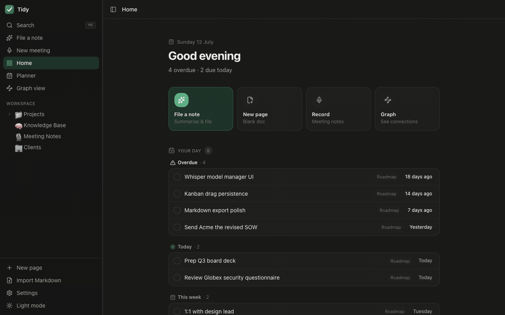
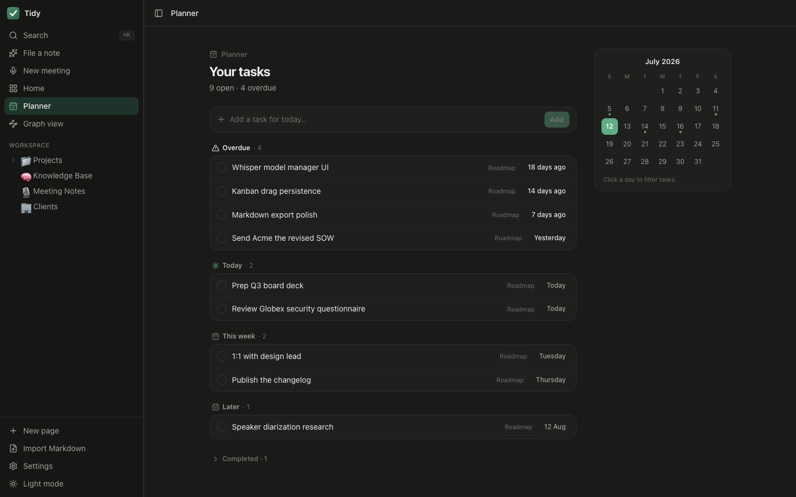
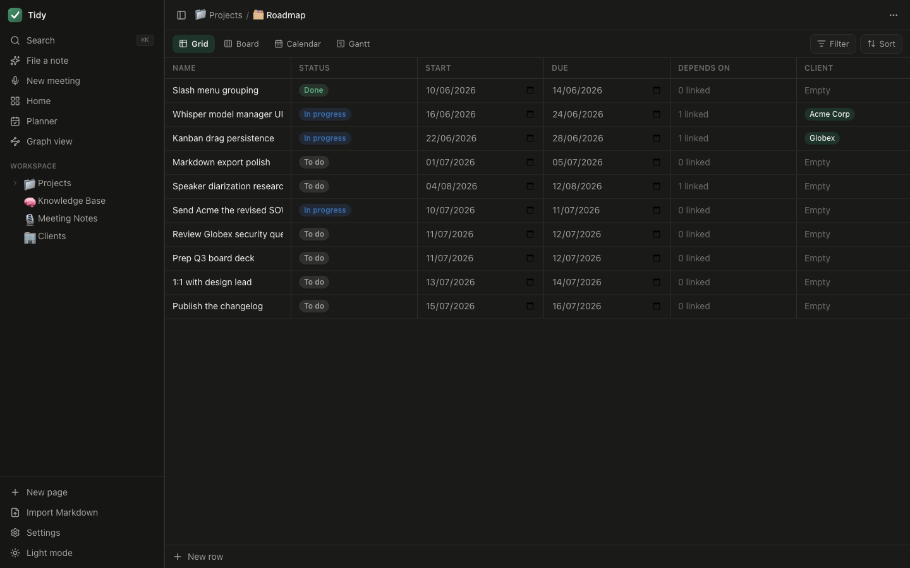
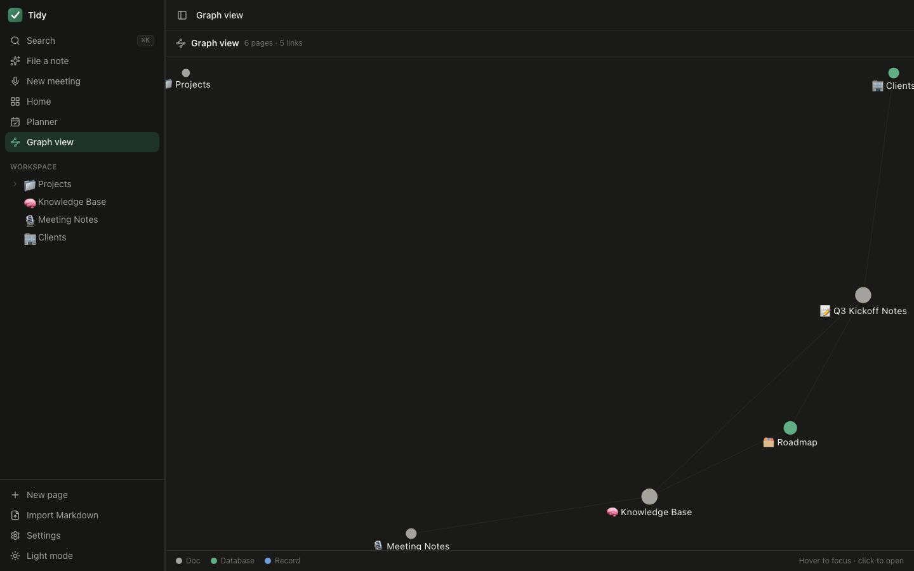
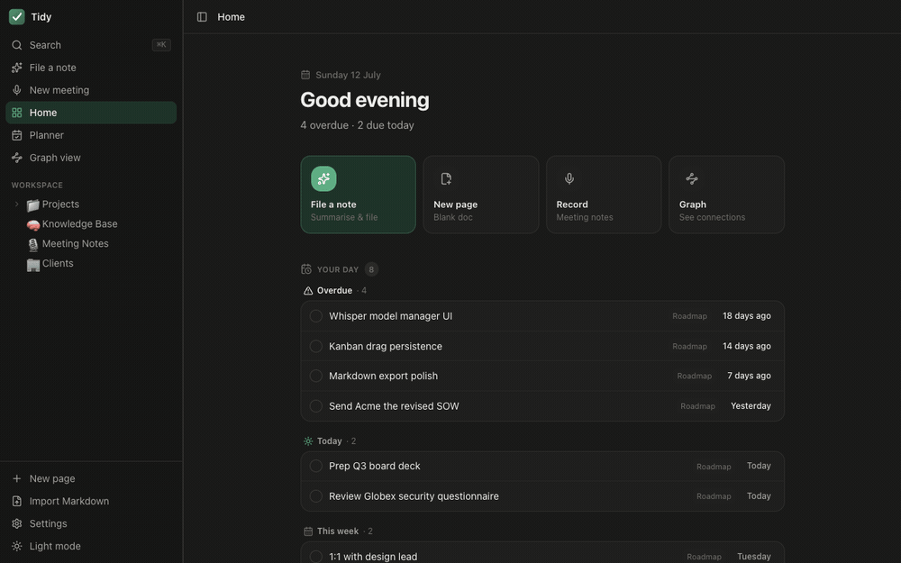

<p align="center">
  
</p>

<p align="center">
  Your notes, tasks, tables and meetings. All in one place, all on your own machine.
</p>

<p align="center">
  
</p>

## What it is

Tidy is a desktop app for people who are sick of keeping their work in six different apps and forty browser tabs. It's a knowledge base, a daily planner, a set of Airtable-style tables, and a meeting recorder, and they all live in the same place and talk to each other.

It runs entirely on your Mac. There's no account, no cloud, no sync and no telemetry. It's free, and it's yours.

## Download

Grab the latest `.dmg` from the [Releases page](https://github.com/REllwood/Tidy/releases), open it, and drag Tidy into your Applications folder. You'll want an Apple Silicon Mac on macOS 14.4 or newer.

It isn't signed with an Apple Developer certificate yet, so the first time you open it macOS will say it "cannot be checked for malicious software". That's expected. Right-click (or Control-click) the Tidy app, choose Open, then Open again. You only have to do that once.

## The planner

<p align="center">
  
</p>

Open Tidy and the first thing it does is show you your day. It pulls every task that has a date, from every table you've got, and sorts them into overdue, today and this week. Tick one off or shove it to next week without leaving the page.

There's a proper planner view as well, with a month calendar, a quick way to add a task, and a completed list for when you want to feel good about yourself.

## Tables that do the sums for you

<p align="center">
  
</p>

A table in Tidy is one dataset you can look at four ways: a grid, a kanban board, a calendar, or a Gantt chart. No copying, no duplicate lists.

The fields go well past text and numbers. You can link rows in one table to rows in another, pull a value across with a lookup, roll a column up into a sum or an average, or write a little formula like `{Budget} * 1.2`. It recalculates as you type.

## Everything's connected

<p align="center">
  
</p>

Link any page to any other by typing `[[` and the page name, the way you would in Obsidian. Backlinks show up on their own, so you can always see what points at a page. The graph view lays the whole lot out so you can see how your notes hang together.

Promote a table row into a full page when a line item grows into something bigger, and it keeps the link back to where it came from.

## It sits in on your meetings

<p align="center">
  
</p>

Hit record and Tidy captures your microphone and the system audio, so you get both sides of a call. When you stop, it transcribes the whole thing on-device with Whisper, works out who said what, and writes up a summary with the action items and decisions using a local model through Ollama. Give it a client name and it files the note under them.

None of the audio leaves your Mac. If you haven't got Ollama running it just saves the transcript and moves on.

## Let your agents file notes for you

Tidy runs a small MCP server, so tools like Claude Code or Codex can drop a note straight into your knowledge base. Hand it a meeting transcript or a brain-dump and it reads the text, works out which client it belongs to, writes a summary, and turns the action items into tasks.

Writes are gated behind a token you generate in Settings, so nothing touches your data unless you say so. Reads and searches are always available.

## Private by default

Your data lives in a local SQLite database on your machine. If you want it as plain text too, point Tidy at a folder and it mirrors every page to Markdown, so you can open it in Obsidian or keep it under version control. Edit a file in that folder and Tidy picks the change up. Edit the same note in both at once and it writes a conflict copy rather than quietly losing one.

## Running it

You need [Node.js](https://nodejs.org) 18+, [Rust](https://rustup.rs), and CMake (`brew install cmake`, for building Whisper). [Ollama](https://ollama.com) is optional and only used for AI summaries.

```bash
npm install

npm run dev          # the web build, with an in-memory mock backend (quickest way to poke around)
npm run tauri dev    # the real desktop app

npm test                    # front-end tests (Vitest)
cargo test --workspace      # Rust tests
```

To build a desktop app:

```bash
./scripts/build-sidecar.sh   # build and stage the MCP server
npm run tauri build          # produces a .app / .dmg
```

## Built with

Tauri 2, React, TypeScript and Tailwind on the front. A shared Rust core handles the storage (SQLite), the transcription (whisper.cpp with Metal), speaker labelling (sherpa-onnx), and the MCP server. Summaries run on your local Ollama.

## Status

Everything above works and is tested. The last mile is packaging: building and signing the desktop app so it opens without macOS grumbling at you.

<br>

<p align="center"><sub>Local-first. Private. Free. Yours.</sub></p>
