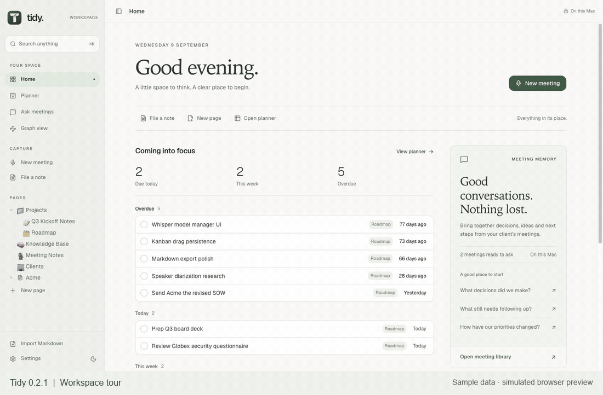
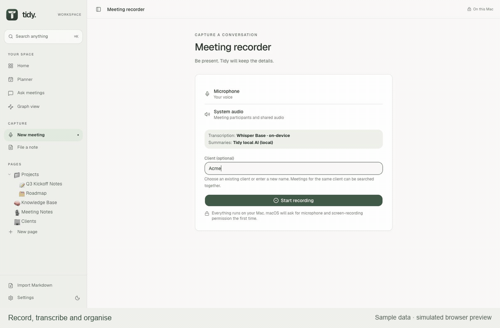
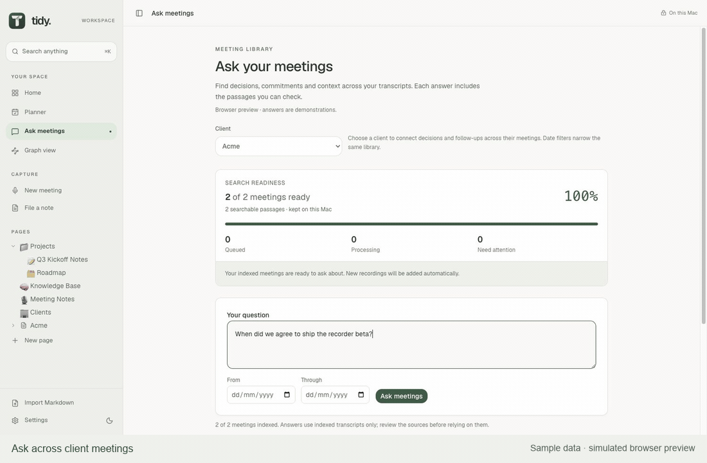
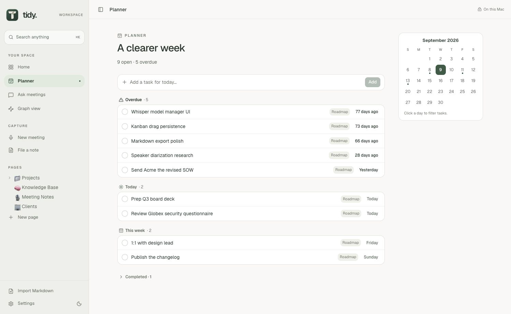
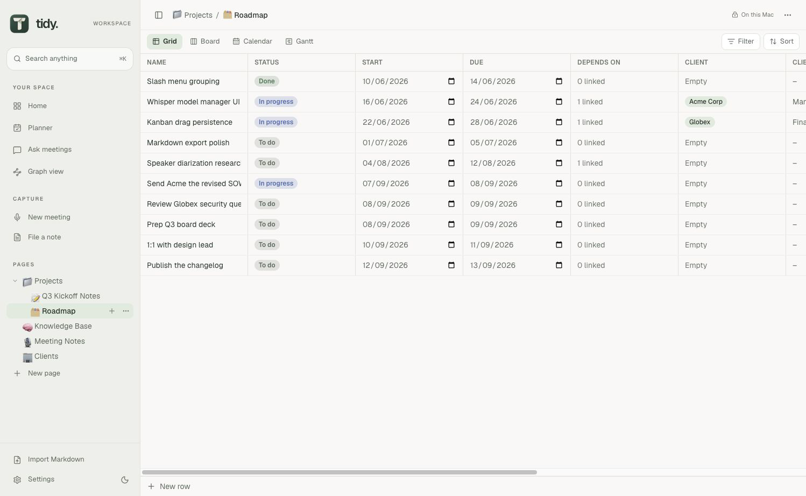
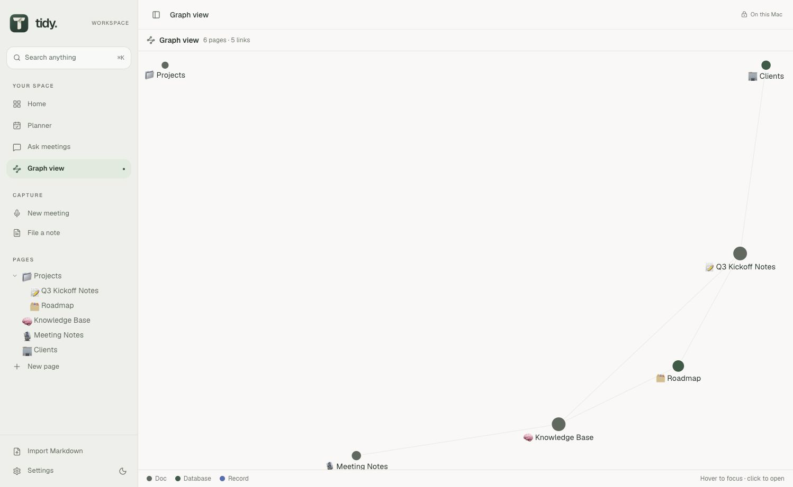

<p align="center">
  
</p>

<p align="center">
  Notes, tasks and meeting transcripts on your Mac.<br />
  Record meetings and ask questions across each client's meeting history.
</p>

<p align="center">
  <a href="https://github.com/REllwood/Tidy/releases/latest">Download for Apple Silicon</a> ·
  <a href="docs/LOCAL-AI.md">Local AI guide</a> ·
  <a href="docs/AI-QUALITY.md">AI quality checks</a>
</p>

<p align="center">
  
</p>

*Captured from the v0.2.1 browser preview with synthetic sample data. Recording, model setup and AI answers in these demonstrations are simulated; timings do not represent desktop performance. [Still images and capture details](docs/screenshots/README.md).*

## Meet Tidy

Tidy brings a block editor, daily planner, relational tables and meeting recorder into one Mac app. Notes link to pages, dated tasks appear in your agenda, and recordings become a searchable meeting library.

No Tidy account, subscription or telemetry. Your workspace lives on your Mac. Model downloads and update checks use an internet connection; transcription and built-in AI processing run locally after setup.

## Install

Download [Tidy v0.3.0 for Apple Silicon](https://github.com/REllwood/Tidy/releases/download/v0.3.0/Tidy_0.3.0_aarch64.dmg), open the DMG and drag **Tidy** into **Applications**.

| | Current release |
| --- | --- |
| Mac | Apple Silicon, M1 and newer |
| macOS | Configured minimum 14.4; release checked on 26.5.2 |
| Distribution | Developer ID signed and notarised by Apple |
| Verification | Signatures, notarisation tickets and Gatekeeper acceptance checked, including the app inside the DMG |

The [release page](https://github.com/REllwood/Tidy/releases/tag/v0.3.0) includes a SHA-256 checksum and upgrade notes. Intel, Windows and Linux installers are not included.

On upgrade, existing transcripts remain in place while older meeting indexes queue for rebuilding. Keep Tidy open with local AI enabled until preparation completes. Use **Regenerate notes** to refresh an existing summary. macOS may ask for microphone and screen-recording permissions again after the application identifier change.

**Updating from v0.2.1:** install v0.3.0 manually using the DMG. Future releases can
be installed through **Settings → Updates**. Tidy checks for updates automatically;
you choose when to download, install and restart.

**Audio is off by default.** Turn on **Settings → Recording → Keep meeting audio**
before a meeting if you want to export or re-transcribe its audio later. Existing
saved audio is preserved. [Recording history and recovery limits](docs/MEETING-RELIABILITY.md).

## From a conversation to useful notes

<p align="center">
  
</p>

1. Open **New meeting** and choose an existing client or enter a new one.
2. Record your microphone and system audio, with separate level meters for each source.
3. Stop to transcribe on-device with Whisper and optional speaker labels.
4. With local AI enabled, Tidy prepares topic sections, decisions, next steps and open questions above the original transcript.

Your transcript is saved before AI processing. If AI is disabled, it remains available and the meeting waits in the preparation queue. Generated action items are suggestions; meeting summaries do not automatically add them to your planner.

## Ask across the same client's meetings

<p align="center">
  
</p>

Choose a client in **Ask meetings**, optionally narrow the dates, and ask about their recordings together. Reuse the same client when recording follow-ups so they belong to the same history.

Questions to try when the information is in your transcripts:

- “What was discussed across these meetings?”
- “Who is responsible for the client handover?”
- “What changed between the kickoff and the follow-up?”
- “Which decisions are still unresolved?”

Specific questions search relevant transcript passages. Broad overviews draw material from across the conversation. Answers link individual claims to their sources and show the passages and meetings used. The library displays ready, queued and failed meetings, with stage and passage progress while work runs.

AI can still miss context or get an inference wrong. Review the original sources for names, dates and commitments. Large-library answers may use a sample of the available material; the displayed coverage makes that visible. Each question is independent. [How retrieval and verification work](docs/LOCAL-AI.md#retrieval-and-answer-limits).

## Local AI, without a separate app

In **Settings → Local AI**, choose **Enable local AI** to download the recommended answer model and meeting search model. Downloads have progress and cancellation controls; you can choose another model or remove downloaded files in Settings.

| Model | Purpose | Approximate download |
| --- | --- | --- |
| Qwen 3 · Balanced | Meeting notes and answers | 2.5 GB |
| Qwen 3 · Lightweight | Lower-memory alternative | 639 MB |
| Nomic meeting search | Find related transcript passages | 146 MB |

The app bundles the inference runtime. **Ollama is optional**, available as an advanced provider. Models load one at a time, and recording pauses background AI work. A 16 GB Mac is offered the balanced model, but speed and memory pressure depend on the meeting and other open apps; we have not benchmarked the full workflow on an M1 with 16 GB. [Setup, model licences and limits](docs/LOCAL-AI.md).

### More model choices

Version 0.3.0 expands transcription to 12 Whisper options, including
English-only models, Large V3, Turbo and compressed versions. It also adds Qwen
answer models at 1.7B, 8B, 14B and 32B alongside the existing 0.6B and 4B choices.
Settings shows download sizes, suggested RAM and filters for lower-memory,
everyday and larger models. Suggestions do not prevent users choosing another
model. RAM guidance is an estimate, and the full range has not been benchmarked across Mac models.

## Keep the rest of your work close

<p align="center">
  
</p>

**A daily agenda and planner.** Home brings dated tasks together from your tables. Review overdue work, complete a task, reschedule it or add something to your week.

<p align="center">
  
</p>

**One dataset, four views.** Use a grid, board, calendar or Gantt chart. Relations, lookups, rollups and formulas keep related information together. Promote a row to a page when it needs more room.

<p align="center">
  
</p>

**Notes that connect.** Use headings, lists and to-dos in the block editor. Type `[[` to link a page, follow backlinks, or explore the graph.

## Your files and your tools

Tidy stores its workspace in local SQLite. An optional Markdown vault mirrors page content to a folder you choose, reads external edits back in and preserves conflicting edits in a separate copy. Generated meeting summaries are currently separate from vault exports; the original page content is exported.

The bundled MCP server lets a connected tool such as Claude Code or Codex read and search the workspace. Writes require the token generated in Tidy Settings. Its separate transcript-ingestion tool still uses local Ollama for summarisation. Connected agents can read your content, so their own data handling also applies. [MCP implementation](crates/mcp/src/main.rs).

## Run from source

Use Node.js 22.12+ with npm, Rust, Xcode command-line tools and CMake. The browser preview uses a mock backend and does not access your desktop workspace.

```bash
npm ci
npm run dev
```

For the native Mac app, build its bundled helpers first:

```bash
bash scripts/build-sidecar.sh
bash scripts/build-ai-runtime.sh
npm run tauri dev
```

Checks:

```bash
npm test
npm run build
DYLD_FALLBACK_LIBRARY_PATH=/usr/lib/swift cargo test --workspace --locked
```

v0.2.1 passed 80 front-end tests, 42 shared-core tests and 14 native unit tests, plus a synthetic client-handover regression using the real local models. These checks are not a general accuracy benchmark. [Evaluation details](docs/AI-QUALITY.md).

Built with Tauri, React, TypeScript, SQLite, whisper.cpp, sherpa-onnx and llama.cpp. Distributed under AGPL-3.0-or-later. Maintainers can follow the [local signing and release guide](docs/RELEASING.md).
