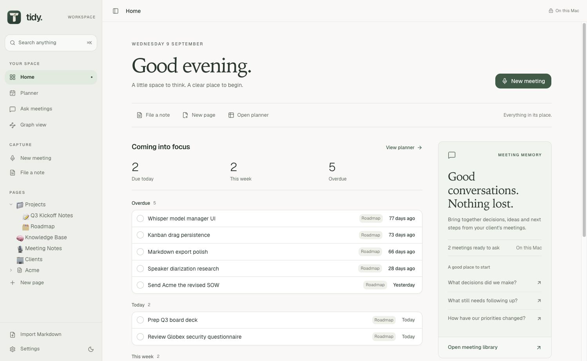
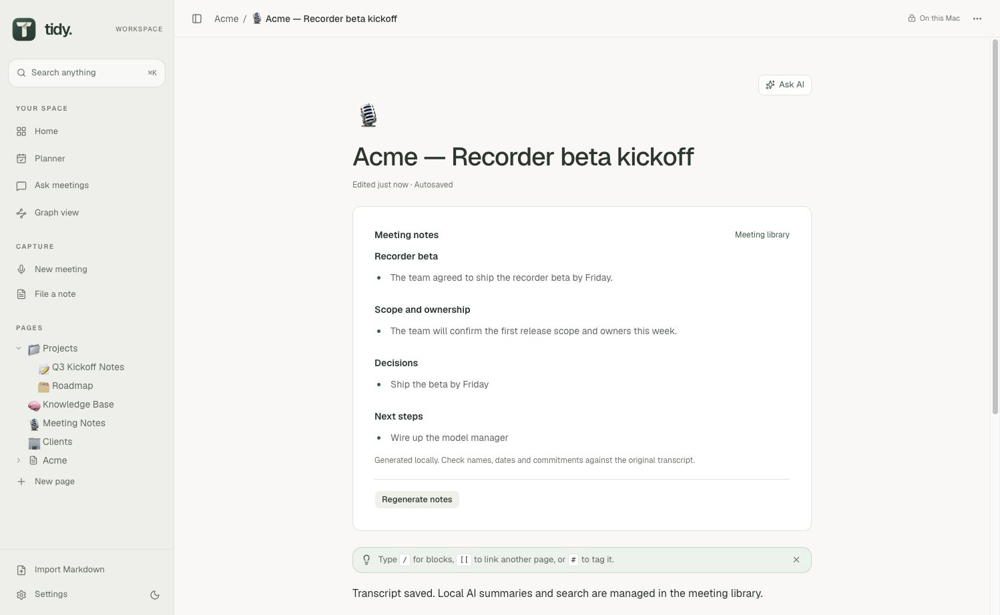
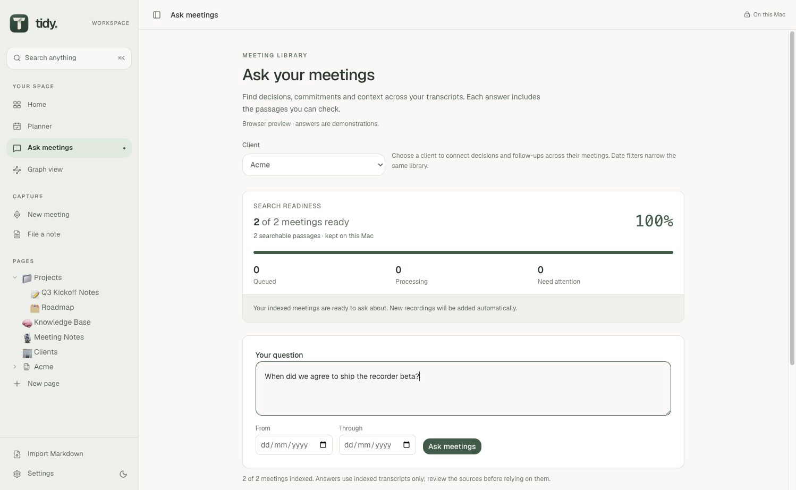
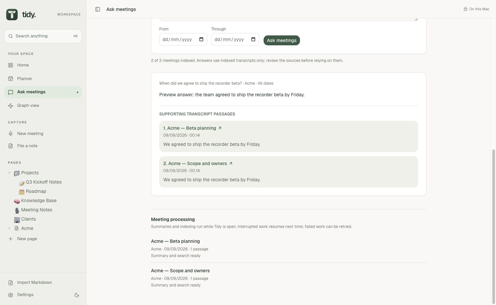
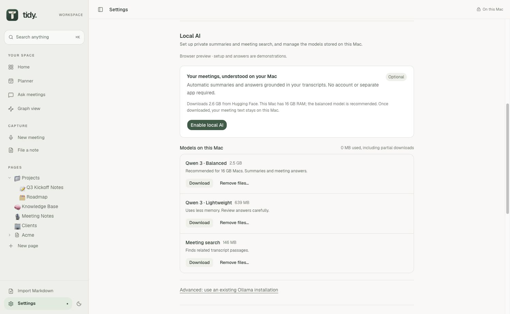
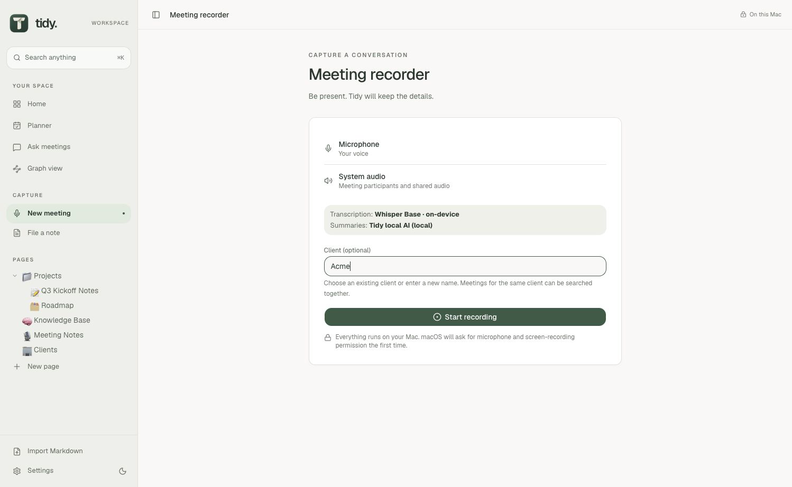

# Tidy v0.2.1 examples

These captures show the current interface using synthetic data in the browser preview. They were captured on 9 September 2026 from the v0.2.1 source. No customer notes, recordings or credentials are included.

The browser preview simulates recording, transcription, model downloads and AI answers. The two Acme meetings use the same built-in sample transcript. They demonstrate client grouping and the source-review interface, not a live comparison of different conversations. Native model evaluation is documented separately in [AI quality checks](../AI-QUALITY.md).

## Walkthroughs

| Animation | What it shows |
| --- | --- |
| [Workspace tour](tour.gif) | Home, planner, tables, structured notes, library readiness and an answer with sources |
| [Meeting capture](meeting.gif) | Selecting a client, audio meters, transcription progress and saved notes |
| [Ask meetings](ask-meetings.gif) | Selecting Acme, asking a question, waiting for an answer and reviewing two meeting sources |

The animations are edited walkthroughs assembled from actual interface captures. Frames are held for readability; their duration is not a measurement of recording, download or inference speed. A permanent caption identifies the simulated preview.

## Still images

### Home

### Structured meeting notes

### Meeting library

### Answer and sources

### Local AI setup

### Meeting recorder

### Planner

### Tables

### Graph

## Refreshing the examples

Run `npm ci` and `npm run dev`. Use a separate browser-preview session with synthetic data; never capture the user's native workspace for public documentation. Enable the simulated Local AI setup, record two preview meetings under the same client and open Ask meetings to capture the question and source-review flow. Capture loading states as well as completed screens.

Use browser screenshots, convert the returned image bytes to genuine PNG files, and assemble GIFs with FFmpeg. Current GIFs use a width of 1,100 pixels, four frames per second, palette optimisation and a persistent simulation caption. Preserve clear text and alt descriptions. Check every frame, internal documentation link and published image after updating.
